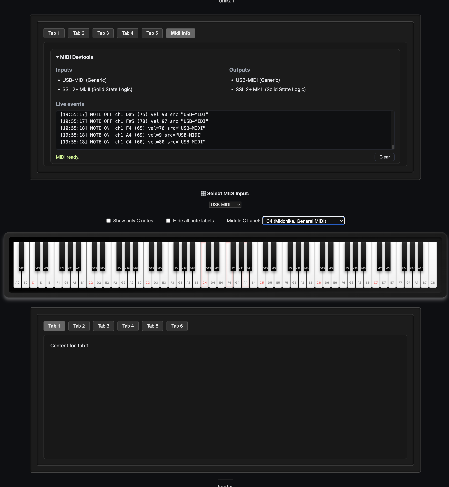

# 🎹 Simple 88-Key Piano Keyboard



A responsive, full-range 88-key visual piano built with HTML, CSS, and vanilla JS, now fully integrated with real-time MIDI input and Midonika diagnostic tools.

Ideal for:

- Visualising MIDI input (hardware or virtual)
- Exploring Middle C naming conventions (C3/C4/C5)
- Auditing live note events via Midonika
- Modular integration into music learning or MIDI tools

---

## ✨ Features

- ✅ **88-Key Visual Keyboard**, A0 to C8, styled with natural white/black layout.
- ✅ **Middle C Convention Selector**, Toggle between C3, C4, or C5 labeling (e.g., Yamaha vs General MIDI vs Notation).
- ✅ **MIDI Input Device Selector**, Dynamically choose from connected devices.
- ✅ **Live Key Highlighting**, Keys glow as you play them from any external controller.
- ✅ **Modular MIDI Bridge**, A clean `midibridge.js` handles note routing from Web MIDI API to the keyboard.
- ✅ **Midonika Integration**, Monitor connected devices, see detailed logs, and debug messages in real-time.
- ✅ **Tab-Based Layout**, Easily extendable interface for future tools.

---

## 🧩 Tech Stack

- HTML5, vanilla JS, and CSS
- Web MIDI API (via `midibridge.js`)
- Custom DOM interface (`window.PianoInterface`)
- Styled via `piano-styles.css`, `layout.css`, and `midonika.css`

---

## 🕹️ Usage

1. **Clone and serve locally**:

   ```bash
   git clone https://github.com/aa-parky/simple-88-keys.git
   cd simple-88-keys
   npx http-server .

   2.	Connect a MIDI device (USB MIDI keyboard, DAW virtual cable, etc.)
   3.	Open the browser, visit http://127.0.0.1:8080/, and select a MIDI device.
   4.	Watch the magic, Keys light up live as you play, with velocity-sensitive logging in Midonika.
   ```

⸻

🛠️ Developer Notes
• You can trigger key highlights manually via console:

window.PianoInterface.noteOn(60); // Middle C ON
window.PianoInterface.noteOff(60); // Middle C OFF

    •	Customize highlight colors in piano-styles.css:

.white-key.active { background: #e06666; }
.black-key.active { background: #aa0000; }

    •	Add audio via the Web Audio API or connect to Tonika/Clavonika ecosystem tools.

⸻

🤝 Credits

Crafted with joy by @aa-parky,
with contributions from ChatGPT (a.k.a. your faithful goblin assistant 🐾).

Built on:
• Midonika, MIDI diagnostics and devtools
• Clavonika, Goblin piano keyboard module

⸻

📜 License

MIT, use freely, modify bravely, and always play in key.
