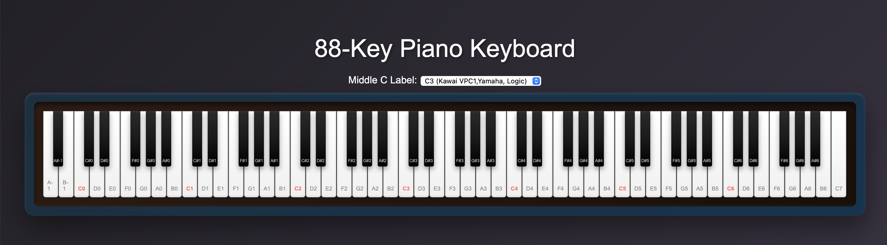

# 88-Key Piano Keyboard (Web Visualizer)

A beautiful, responsive (or optionally fixed-width) web-based 88-key piano visualizer built in vanilla JavaScript, HTML, and CSS.

- 🎹 Supports full 88-key range from A0 (MIDI 21) to C8 (MIDI 108)
- 🔁 Toggle between C3 / C4 / C5 octave conventions for Middle C
- 🎨 Styled for clarity, hover feedback, and performance use
- 🎛️ Optional expansion for MIDI input/output, velocity display, etc.

---

## 🛠 Usage

Clone or download the repo, then open `index.html` in any modern browser:

```bash
git clone https://github.com/your-username/88-key-piano.git
cd 88-key-piano
open index.html
```
