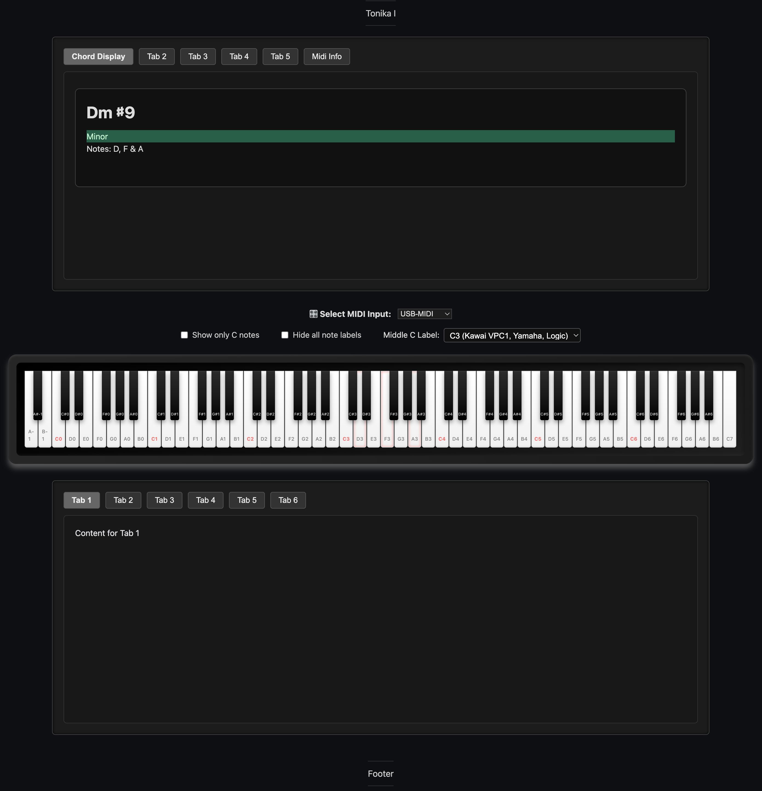

# 🎹 Simple 88-Key Piano Keyboard + Chord Detection



A responsive, full-range 88-key visual piano built with HTML, CSS, and vanilla JS, now with **real-time MIDI chord recognition** and diagnostic logging via **Midonika**.

---

## 🧠 What's New

🎶 **Jazz-Inspired Chord Detection Engine**

- Live analysis of incoming MIDI notes
- Identifies chords using custom interval pattern logic
- Smart root detection
- Instant display of chord names above the keyboard
- Modular: easy to improve or replace with machine-learned models in future

---

## ✨ Features

✅ **88-Key Visual Keyboard**, from A0 to C8  
✅ **Middle C Convention Selector**, toggle between C3, C4, or C5  
✅ **Live MIDI Input**, keys glow as notes are played  
✅ **Chord Analyzer**, shows jazz/pop-style chord labels in real time  
✅ **Chord Display Panel**, dynamic DOM updates with chord name + notes  
✅ **Modular Codebase**, clean separation of MIDI bridge, piano rendering, and chord logic  
✅ **Midonika Integration**, live MIDI logs, great for debugging and testing  
✅ **Dark Theme Friendly**, easily stylable and embeddable in music tools

---

## 🧩 File Structure

```bash
.
├── index.html               # Entry point
├── css/
│   └── styles.css           # Piano + display layout
├── js/
│   ├── piano.js             # Piano key generation and UI events
│   ├── midibridge.js        # MIDI routing and noteOn/noteOff handling
│   ├── midi-api-bridge.js   # Web MIDI API setup and permission management
│   ├── chord-analyzer.js    # NEW: Chord detection logic
│   ├── chord-display.js     # NEW: UI update logic for displaying chords
│   ├── tabs.js              # Middle C / tab menu control
│   └── midonika.iife.js     # External diagnostic tool (optional)
├── images/
│   └── screenshot.png       # App preview
└── README.md                # This file


⸻

🚀 Getting Started

1. Clone & Run

git clone https://github.com/aa-parky/simple-88-keys.git
cd simple-88-keys
npx http-server .

Or open index.html directly in a modern browser (Chrome recommended).

2. Connect MIDI Controller

Plug in any class-compliant USB MIDI device. Accept browser MIDI permissions. Notes will highlight live, and chords will appear as detected.

⸻

⚙️ Dev Notes
   •	Chord Detection Logic: Based on sorted MIDI pitches + interval matching
   •	Extensible: Easily add new chord types or alternative detection methods
   •	Test Manually: Use browser console:

window.PianoInterface.noteOn(60);
window.PianoInterface.noteOff(60);


⸻

📦 License

MIT,  free to use, modify, or embed in your own MIDI or music theory tools.

Built with goblin glee by aa-parky and ChatGPT 💚

---
```
